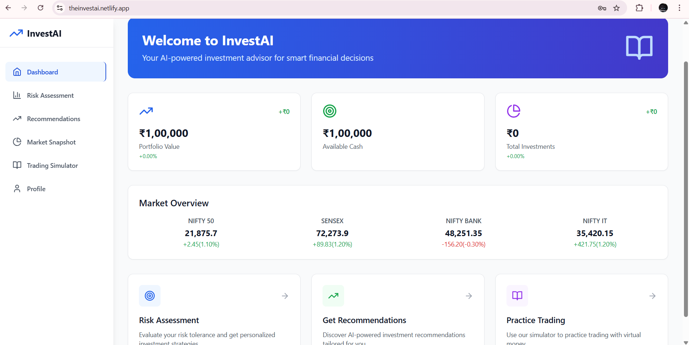

# 🚀 InvestAI - GenAI Investment Advisor for Indian Retail Investors

A comprehensive, AI-powered investment advisory platform designed specifically for Indian retail investors. This application provides personalized investment recommendations, risk assessment, market analysis, and virtual trading capabilities - all powered by intelligent algorithms and working entirely with static data for demonstration purposes.

# 🌐 Visit Live Demo
Check out the live demo here: [https://theinvestai.netlify.app/](https://theinvestai.netlify.app/)

--- 
## 📸 Preview
## 1.InvestAI Dashboard


## 2.Risk Assessment


## 3.Recommendations


## 4.Market Overview


## 5.Trading Simulator


## 6.Profile Management


## 📋 Project Overview

The GenAI Investment Advisor is a full-stack web application that democratizes investment advice for Indian retail investors. It combines sophisticated risk assessment algorithms, personalized recommendation engines, and educational content to guide users through their investment journey.

### Key Features
- 🎯 **Intelligent Risk Assessment** - Dynamic scoring algorithm with weighted factors
- 📊 **Personalized Recommendations** - AI-driven investment suggestions based on risk profile
- 📈 **Market Snapshot** - Real-time market visualization with interactive charts
- 💼 **Virtual Trading Simulator** - Paper trading with portfolio tracking
- 🎓 **Educational Content** - Context-aware financial literacy resources
- 👤 **User Profile Management** - Comprehensive profile and preference management

## 🛠️ Tech Stack

### Frontend
- **React 18** - Modern React with hooks and functional components
- **TypeScript** - Type-safe development with enhanced IDE support
- **Tailwind CSS** - Utility-first CSS framework for rapid UI development
- **Vite** - Next-generation frontend build tool
- **React Router DOM** - Declarative routing for React applications
- **Lucide React** - Beautiful & consistent icon library

### State Management
- **React Context API** - Global state management with custom hooks
- **LocalStorage** - Persistent client-side data storage

### Data & Charts
- **Custom SVG Charts** - Lightweight, responsive chart components
- **Mock Data Architecture** - Comprehensive static data structure
- **JSON-based Storage** - Structured data management

### Development Tools
- **ESLint** - Code linting and quality assurance
- **PostCSS** - CSS processing and optimization
- **Autoprefixer** - Automatic CSS vendor prefixing

## 🏗️ Application Architecture

```
┌─────────────────────────────────────────────────────────────┐
│                    Frontend (React + TypeScript)            │
├─────────────────────────────────────────────────────────────┤
│  ┌─────────────┐  ┌─────────────┐  ┌─────────────┐         │
│  │    Auth     │  │    User     │  │  Portfolio  │         │
│  │   Context   │  │   Context   │  │   Context   │         │
│  └─────────────┘  └─────────────┘  └─────────────┘         │
├─────────────────────────────────────────────────────────────┤
│  ┌─────────────┐  ┌─────────────┐  ┌─────────────┐         │
│  │   Login/    │  │    Risk     │  │Recommenda-  │         │
│  │   Signup    │  │ Assessment  │  │    tions    │         │
│  └─────────────┘  └─────────────┘  └─────────────┘         │
│  ┌─────────────┐  ┌─────────────┐  ┌─────────────┐         │
│  │   Market    │  │  Trading    │  │   Profile   │         │
│  │  Snapshot   │  │  Simulator  │  │ Management  │         │
│  └─────────────┘  └─────────────┘  └─────────────┘         │
├─────────────────────────────────────────────────────────────┤
│                    Data Layer (LocalStorage)                │
│  ┌─────────────┐  ┌─────────────┐  ┌─────────────┐         │
│  │    User     │  │    Risk     │  │  Portfolio  │         │
│  │  Profiles   │  │  Profiles   │  │    Data     │         │
│  └─────────────┘  └─────────────┘  └─────────────┘         │
└─────────────────────────────────────────────────────────────┘
```

### Component Structure
```
src/
├── components/
│   └── Layout/
│       ├── Header.tsx          # Navigation header
│       └── Sidebar.tsx         # Main navigation sidebar
├── contexts/
│   ├── AuthContext.tsx         # Authentication state
│   ├── UserContext.tsx         # User profile & risk data
│   └── PortfolioContext.tsx    # Trading & portfolio state
├── pages/
│   ├── Login.tsx              # Authentication page
│   ├── Home.tsx               # Dashboard overview
│   ├── RiskQuiz.tsx           # Risk assessment form
│   ├── Recommendations.tsx     # AI-powered suggestions
│   ├── MarketSnapshot.tsx     # Market analysis & charts
│   ├── Simulator.tsx          # Virtual trading platform
│   └── Profile.tsx            # User profile management
├── data/
│   └── mockData.ts            # Static data & market information
└── App.tsx                    # Main application component
```

## 👤 User Journey


### Detailed User Flow

1. **Authentication** - Secure signup/login with email validation
2. **Risk Profiling** - 5-question assessment covering:
   - Age and life stage
   - Annual household income
   - Investment time horizon
   - Risk tolerance and market behavior
   - Financial goals and objectives
3. **Score Calculation** - Weighted algorithm produces 0-100 risk score
4. **Asset Allocation** - Dynamic allocation bands based on risk profile
5. **Recommendations** - Filtered and ranked investment options
6. **Market Research** - Interactive charts and market analysis
7. **Virtual Trading** - Paper trading with real-time portfolio updates
8. **Continuous Learning** - Educational content and tips throughout

## 🔄 Data Flow

### Authentication Flow
```typescript
User Input → Validation → LocalStorage → Context State → UI Update
```

### Risk Assessment Flow
```typescript
Quiz Responses → Weighted Scoring Algorithm → Risk Profile → Asset Allocation → Recommendations
```

### Trading Flow
```typescript
Trade Order → Validation → Portfolio Update → Transaction Log → LocalStorage → UI Refresh
```

### Data Persistence Strategy
- **User Accounts**: `investmentAdvisor_users`
- **Current Session**: `investmentAdvisor_currentUser`
- **Risk Profiles**: `investmentAdvisor_riskProfile_{userId}`
- **Portfolios**: `investmentAdvisor_portfolio_{userId}`

## 🤖 AI Implementation

### 1. Risk Scoring Algorithm
```typescript
const calculateRiskScore = (): number => {
  let totalScore = 0;
  let totalWeight = 0;

  // Age-based risk capacity (25% weight)
  if (answers.age) {
    const ageOption = questions[0].options.find(opt => opt.value === answers.age);
    if (ageOption) {
      totalScore += ageOption.weight * 25;
      totalWeight += 25;
    }
  }

  // Income assessment (20% weight)
  // Investment horizon (30% weight)
  // Risk tolerance (15% weight)
  // Financial goals (10% weight)

  return totalWeight > 0 ? Math.round(totalScore) : 0;
};
```

### 2. Dynamic Asset Allocation
```typescript
const getAllocation = (score: number) => {
  if (score <= 30) return { equity: 20, debt: 50, government: 30 };      // Conservative
  if (score <= 50) return { equity: 40, debt: 40, government: 20 };      // Moderate
  if (score <= 70) return { equity: 60, debt: 25, government: 15 };      // Balanced
  return { equity: 80, debt: 15, government: 5 };                        // Aggressive
};
```

### 3. Intelligent Recommendation Engine
```typescript
const recommendations = useMemo(() => {
  const { score } = riskProfile;
  
  // Smart filtering based on risk tolerance
  const equityRecs = investments
    .filter(inv => inv.type === 'equity')
    .filter(inv => {
      if (score <= 30) return inv.riskLevel === 'low';
      if (score <= 50) return inv.riskLevel === 'low' || inv.riskLevel === 'medium';
      return true;
    })
    .sort((a, b) => {
      if (score <= 40) return a.volatility - b.volatility;  // Low volatility first
      return b.threeYearReturn - a.threeYearReturn;          // High returns first
    });
}, [riskProfile]);
```

### 4. Contextual Explanations
- **Investment Rationale**: AI-generated explanations for each recommendation
- **Risk Warnings**: Dynamic risk alerts based on user profile
- **Educational Content**: Context-aware learning materials
- **Market Insights**: Intelligent market trend analysis

### 5. Behavioral Analysis
- **User Interaction Tracking**: Monitor user preferences and behaviors
- **Adaptive UI**: Interface adjusts based on user expertise level
- **Personalized Alerts**: Smart notifications based on portfolio and market conditions

## 📊 Impact & Benefits

### For Retail Investors
- **Democratized Access**: Professional-grade investment advice for everyone
- **Risk-Aware Investing**: Scientifically-backed risk assessment
- **Educational Empowerment**: Learn while you invest
- **Safe Practice Environment**: Risk-free virtual trading

### For the Indian Market
- **Financial Inclusion**: Bringing investment advisory to underserved segments
- **Investor Education**: Improving financial literacy across demographics
- **Market Participation**: Encouraging systematic investment approaches
- **Technology Adoption**: Modernizing traditional investment advisory

## 🚀 How to Run

### Prerequisites
- Node.js 18+ and npm
- Modern web browser (Chrome, Firefox, Safari, Edge)

### Installation & Setup
```bash
# Clone the repository
git clone https://github.com/yourusername/genai-investment-advisor.git
cd genai-investment-advisor

# Install dependencies
npm install

# Start development server
npm run dev

# Build for production
npm run build

# Preview production build
npm run preview
```

### Development Commands
```bash
# Type checking
npm run typecheck

# Linting
npm run lint

# Development with hot reload
npm run dev
```

### Environment Setup
No environment variables required! The application works entirely with static data.

### Browser Support
- Chrome 90+
- Firefox 88+
- Safari 14+
- Edge 90+

## 🔮 Future Implementations

### 1. LLM Integration (GPT-4 / Google Gemini)

#### Conversational Investment Advisor
```typescript
// Integration with OpenAI GPT-4
const generatePersonalizedAdvice = async (userProfile: UserProfile, query: string) => {
  const response = await openai.chat.completions.create({
    model: "gpt-4",
    messages: [
      {
        role: "system",
        content: `You are an expert investment advisor for Indian retail investors. 
                 User profile: ${JSON.stringify(userProfile)}`
      },
      {
        role: "user",
        content: query
      }
    ],
    temperature: 0.7,
    max_tokens: 500
  });
  
  return response.choices[0].message.content;
};
```

#### Smart Document Analysis
```typescript
// Google Gemini for financial document analysis
const analyzeFinancialDocument = async (documentText: string) => {
  const genAI = new GoogleGenerativeAI(API_KEY);
  const model = genAI.getGenerativeModel({ model: "gemini-pro" });
  
  const prompt = `Analyze this financial document and provide investment insights: ${documentText}`;
  const result = await model.generateContent(prompt);
  
  return result.response.text();
};
```

#### Planned LLM Features
- **Natural Language Queries**: "Should I invest in tech stocks now?"
- **Document Analysis**: Upload annual reports, get AI insights
- **Market Commentary**: AI-generated daily market analysis
- **Personalized Learning**: Adaptive educational content
- **Risk Scenario Planning**: AI-powered what-if analysis

### 2. API Integrations

#### Real-time Market Data
```typescript
// Alpha Vantage Integration
const fetchRealTimeData = async (symbol: string) => {
  const response = await fetch(
    `https://www.alphavantage.co/query?function=GLOBAL_QUOTE&symbol=${symbol}&apikey=${API_KEY}`
  );
  return response.json();
};

// NSE/BSE Data Integration
const fetchIndianStockData = async (symbol: string) => {
  const response = await fetch(`https://api.nseindia.com/api/quote-equity?symbol=${symbol}`);
  return response.json();
};
```

#### News & Sentiment Analysis
```typescript
// News API Integration
const fetchMarketNews = async () => {
  const response = await fetch(
    `https://newsapi.org/v2/everything?q=indian+stock+market&apiKey=${API_KEY}`
  );
  return response.json();
};

// Sentiment Analysis
const analyzeSentiment = async (newsText: string) => {
  const response = await fetch('https://api.meaningcloud.com/sentiment-2.1', {
    method: 'POST',
    body: new FormData([['key', API_KEY], ['txt', newsText]])
  });
  return response.json();
};
```

#### Planned API Integrations
- **NSE/BSE APIs**: Real-time Indian stock market data
- **RBI APIs**: Government bond rates and monetary policy updates
- **News APIs**: Financial news aggregation and sentiment analysis
- **Economic Data**: GDP, inflation, and macroeconomic indicators
- **Mutual Fund APIs**: NAV data and fund performance metrics

### 3. PostgreSQL Database Implementation

#### Database Schema Design
```sql
-- Users table
CREATE TABLE users (
    id UUID PRIMARY KEY DEFAULT gen_random_uuid(),
    email VARCHAR(255) UNIQUE NOT NULL,
    password_hash VARCHAR(255) NOT NULL,
    name VARCHAR(255) NOT NULL,
    created_at TIMESTAMP DEFAULT CURRENT_TIMESTAMP,
    updated_at TIMESTAMP DEFAULT CURRENT_TIMESTAMP
);

-- Risk profiles table
CREATE TABLE risk_profiles (
    id UUID PRIMARY KEY DEFAULT gen_random_uuid(),
    user_id UUID REFERENCES users(id) ON DELETE CASCADE,
    age INTEGER NOT NULL,
    income DECIMAL(15,2) NOT NULL,
    investment_horizon INTEGER NOT NULL,
    risk_tolerance INTEGER NOT NULL,
    financial_goals JSONB NOT NULL,
    risk_score INTEGER NOT NULL,
    allocation JSONB NOT NULL,
    created_at TIMESTAMP DEFAULT CURRENT_TIMESTAMP
);

-- Portfolios table
CREATE TABLE portfolios (
    id UUID PRIMARY KEY DEFAULT gen_random_uuid(),
    user_id UUID REFERENCES users(id) ON DELETE CASCADE,
    cash_balance DECIMAL(15,2) DEFAULT 100000.00,
    created_at TIMESTAMP DEFAULT CURRENT_TIMESTAMP,
    updated_at TIMESTAMP DEFAULT CURRENT_TIMESTAMP
);

-- Holdings table
CREATE TABLE holdings (
    id UUID PRIMARY KEY DEFAULT gen_random_uuid(),
    portfolio_id UUID REFERENCES portfolios(id) ON DELETE CASCADE,
    symbol VARCHAR(50) NOT NULL,
    name VARCHAR(255) NOT NULL,
    type VARCHAR(50) NOT NULL,
    quantity INTEGER NOT NULL,
    avg_price DECIMAL(10,2) NOT NULL,
    current_price DECIMAL(10,2) NOT NULL,
    created_at TIMESTAMP DEFAULT CURRENT_TIMESTAMP,
    updated_at TIMESTAMP DEFAULT CURRENT_TIMESTAMP
);

-- Transactions table
CREATE TABLE transactions (
    id UUID PRIMARY KEY DEFAULT gen_random_uuid(),
    portfolio_id UUID REFERENCES portfolios(id) ON DELETE CASCADE,
    symbol VARCHAR(50) NOT NULL,
    type VARCHAR(10) NOT NULL CHECK (type IN ('buy', 'sell')),
    quantity INTEGER NOT NULL,
    price DECIMAL(10,2) NOT NULL,
    total_amount DECIMAL(15,2) NOT NULL,
    created_at TIMESTAMP DEFAULT CURRENT_TIMESTAMP
);

-- Market data table
CREATE TABLE market_data (
    id UUID PRIMARY KEY DEFAULT gen_random_uuid(),
    symbol VARCHAR(50) NOT NULL,
    price DECIMAL(10,2) NOT NULL,
    change_amount DECIMAL(10,2),
    change_percent DECIMAL(5,2),
    volume BIGINT,
    timestamp TIMESTAMP DEFAULT CURRENT_TIMESTAMP,
    UNIQUE(symbol, timestamp)
);
```

#### Database Integration Layer
```typescript
// Database connection setup
import { Pool } from 'pg';

const pool = new Pool({
  connectionString: process.env.DATABASE_URL,
  ssl: process.env.NODE_ENV === 'production' ? { rejectUnauthorized: false } : false
});

// User service
export class UserService {
  static async createUser(email: string, passwordHash: string, name: string) {
    const query = 'INSERT INTO users (email, password_hash, name) VALUES ($1, $2, $3) RETURNING *';
    const result = await pool.query(query, [email, passwordHash, name]);
    return result.rows[0];
  }

  static async getUserByEmail(email: string) {
    const query = 'SELECT * FROM users WHERE email = $1';
    const result = await pool.query(query, [email]);
    return result.rows[0];
  }
}

// Portfolio service
export class PortfolioService {
  static async getUserPortfolio(userId: string) {
    const query = `
      SELECT p.*, 
             json_agg(h.*) as holdings,
             json_agg(t.*) as transactions
      FROM portfolios p
      LEFT JOIN holdings h ON p.id = h.portfolio_id
      LEFT JOIN transactions t ON p.id = t.portfolio_id
      WHERE p.user_id = $1
      GROUP BY p.id
    `;
    const result = await pool.query(query, [userId]);
    return result.rows[0];
  }
}
```

#### Planned Database Features
- **User Authentication**: Secure password hashing with bcrypt
- **Data Relationships**: Proper foreign key constraints and referential integrity
- **Performance Optimization**: Indexes on frequently queried columns
- **Data Analytics**: Historical performance tracking and analysis
- **Backup & Recovery**: Automated database backups and point-in-time recovery
- **Scalability**: Connection pooling and query optimization

### 4. Advanced Features Roadmap

#### Machine Learning Integration
- **Portfolio Optimization**: Modern Portfolio Theory implementation
- **Predictive Analytics**: Stock price prediction models
- **Risk Assessment**: Advanced risk modeling with Monte Carlo simulations
- **Behavioral Analysis**: User behavior pattern recognition

#### Mobile Application
- **React Native**: Cross-platform mobile app
- **Push Notifications**: Real-time market alerts
- **Biometric Authentication**: Fingerprint and face recognition
- **Offline Capabilities**: Core features available without internet

#### Advanced Analytics
- **Performance Attribution**: Detailed portfolio performance analysis
- **Tax Optimization**: Tax-loss harvesting suggestions
- **Goal-based Investing**: SIP calculators and goal tracking
- **Social Features**: Investment community and discussion forums

## 📄 License

This project is licensed under the MIT License - see the [LICENSE](LICENSE) file for details.

## 🤝 Contributing

We welcome contributions! Please see our [Contributing Guidelines](CONTRIBUTING.md) for details.

---

**Built with ❤️ for Indian retail investors**

*Empowering financial freedom through intelligent technology*
